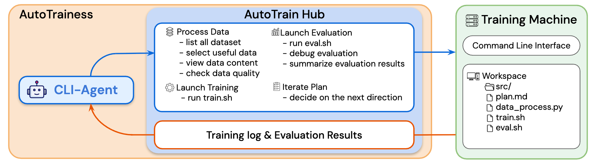
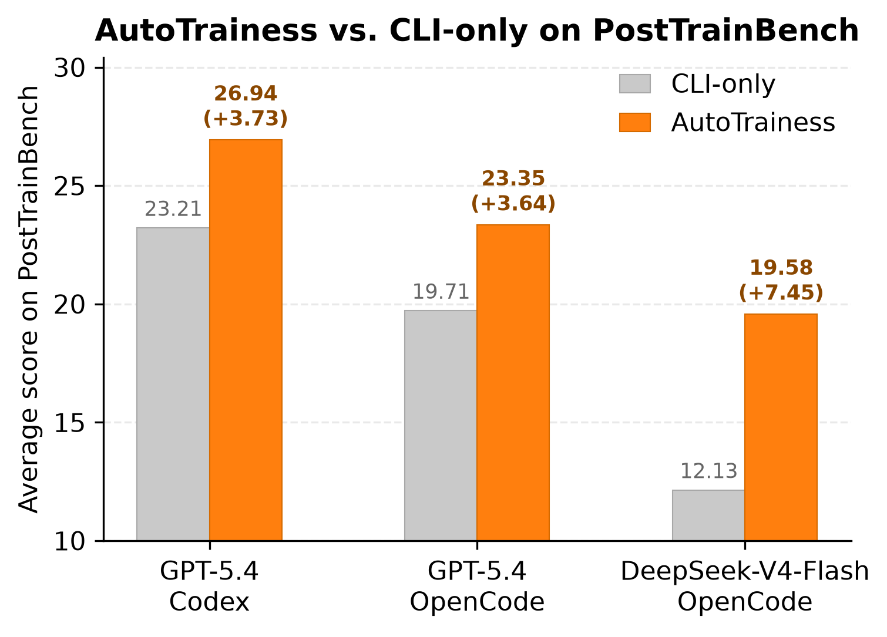

# AutoTrainess

<p align="center">
  
</p>

<p align="center">
  <strong>Teaching Language Models to Improve Language Models Autonomously</strong><br>
  A training-specialized Agent-Computer Interface for Autonomous LLM Improvement.
</p>

<p align="center">
  <a href="docs/autotrainess_paper.pdf">Paper</a> ·
  <a href="README_zh.md">中文说明</a> ·
  <a href="#results">Results</a> ·
  <a href="#quick-start">Quick Start</a> ·
  <a href="#full-code-branch">Full Code Branch</a>
</p>

## Overview

AutoTrainess is an LM-agent framework for autonomous LLM post-training. Instead of leaving an agent in a raw CLI environment with an underspecified action space, AutoTrainess exposes post-training as a set of structured, reusable Agent-Computer Interfaces through **AutoTrainHub**.

The core idea is simple: give the agent the same operational scaffolding that experienced training engineers rely on. AutoTrainHub turns post-training into a closed loop:

```text
iteration_plan -> data -> train -> eval -> log
```

This branch contains the reusable instructions and skills from AutoTrainess. The complete benchmark runner and full pipeline live on the `full-code` branch.

## Results

<p align="center">
  
</p>

On PostTrainBench, AutoTrainess consistently improves over CLI-only agents under the same 10-hour H20 GPU budget. The paper evaluates each agent across four base models, Qwen3-1.7B, Qwen3-4B, SmolLM3-3B, and Gemma-3-4B, and seven benchmarks covering math, code, function calling, knowledge, health, and general instruction following.

| Harness | CLI-only | AutoTrainess | Gain |
| --- | ---: | ---: | ---: |
| GPT-5.4 + Codex | 23.21 | **26.94** | +3.73 |
| GPT-5.4 + OpenCode | 19.71 | **23.35** | +3.64 |
| DeepSeek-V4-Flash + OpenCode | 12.13 | **19.58** | +7.45 |

The ablations show why the interface matters. On the Qwen3-4B subset with GPT-5.4 Codex, the full AutoTrainess setup scores 32.6, while removing data processing drops to 29.1, removing training drops to 20.2, removing evaluation drops to 24.0, and removing logging and planning drops to 24.1.

## How It Works

| Interface | What it gives the agent |
| --- | --- |
| `iteration_plan` | A concrete hypothesis, planned intervention, and success criterion for the next iteration. |
| `data` | Data selection, construction, and validation that align training examples with the benchmark-facing interface while guarding against leakage and format errors. |
| `train` | A stable LlamaFactory-based training workflow with small validation runs and an evaluation-ready `final_model/` export. |
| `eval` | Real benchmark evaluation, raw output capture, sample summaries, and failure-mode diagnosis. |
| `log` | Persistent experiment memory across long-running training sessions. |

The interfaces are designed to reduce common autonomous-training failures: invalid data schemas, wrong chat templates, unstable training handoffs, inconsistent evaluation commands, and loss of experiment state across iterations.

## Quick Start

### Codex

Copy the AutoTrainess instruction file and skills into your target setup:

```bash
cp AGENTS.md /path/to/your/workspace/AGENTS.md
mkdir -p ~/.codex/skills
cp -r autotrainhub/* ~/.codex/skills/
```

For the baseline prompt:

```bash
cp AGENTS_baseline.md /path/to/your/workspace/AGENTS.md
```

### OpenCode

Use the same reusable assets with OpenCode:

```bash
cp AGENTS.md /path/to/your/workspace/AGENTS.md
mkdir -p ~/.opencode/skills
cp -r autotrainhub/* ~/.opencode/skills/
```

For the baseline prompt:

```bash
cp AGENTS_baseline.md /path/to/your/workspace/AGENTS.md
```

## Repository Layout

| Path | Purpose |
| --- | --- |
| `AGENTS.md` | Main AutoTrainess instruction file with staged training and evaluation rules. |
| `AGENTS_baseline.md` | CLI-only baseline prompt without the AutoTrainess stage structure. |
| `autotrainhub/` | Reusable skills for planning, data processing, training, evaluation, and logging. |
| `docs/autotrainess_paper.pdf` | Paper draft describing the method, experiments, and analysis. |
| `figs/` | Figures used in this README. |

## Full Code Branch

Use `full-code` when you want to run the complete benchmark pipeline instead of only reusing the instructions and skills:

```bash
git checkout full-code
```

That branch contains the runner scripts, agent wrappers, evaluation tasks, resource download scripts, and full quick-start documentation.
